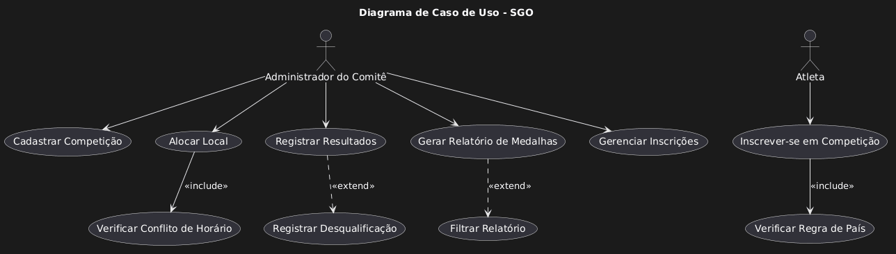

# Sistema de Gestão das Olimpíadas (SGO)

## Descrição do Sistema

Este repositório contém a documentação e a modelagem UML para o **Sistema de Gestão das Olimpíadas (SGO)**. O sistema foi projetado para gerenciar competições, inscrições de atletas, alocação de locais e controle de resultados para as Olimpíadas, conforme os requisitos do trabalho acadêmico.

O projeto não inclui a implementação do código-fonte, focando exclusivamente na arquitetura e diagramação do sistema.

---

## Histórias de Usuário

As seguintes histórias de usuário foram definidas a partir das regras de negócio do sistema:

-   **US01:** Como `Administrador do Comitê`, eu quero `cadastrar novas competições` (com modalidade, data, horário e local) para que o evento possa ser organizado.
-   **US02:** Como `Atleta`, eu quero `me inscrever em uma ou mais competições` para poder participar das Olimpíadas.
-   **US03:** Como `Administrador do Comitê`, eu quero `visualizar a lista de atletas inscritos` em cada competição para gerenciar a participação.
-   **US04:** Como `Administrador do Comitê`, eu quero `alocar um local para cada competição`, garantindo que não haja conflitos de horário, para que as provas ocorram sem problemas.
-   **US05:** Como `Administrador do Comitê`, eu quero `registrar os resultados` de cada competição (1º, 2º e 3º lugares) para oficializar os vencedores.
-   **US06:** Como `Administrador do Comitê`, eu quero `gerar um relatório de medalhas por país` para acompanhar o desempenho geral das nações.

---

## Estrutura do Repositório

O repositório está organizado da seguinte forma para atender aos requisitos de entrega:

```
.
├── README.md
├── codigos/
│   ├── diagrama-de-caso-de-uso.puml
│   ├── diagrama-de-classes.puml
│   ├── diagrama-de-pacotes.puml
│   ├── diagrama-de-componentes.puml
│   └── diagrama-de-implantação.puml
└── imagens/
    ├── diagrama-de-caso-de-uso.png
    ├── diagrama-de-classes.png
    ├── diagrama-de-pacotes.png
    ├── diagrama-de-componentes.png
    └── diagrama-de-implantação.png
```

-   **`README.md`**: Este arquivo, com a documentação principal.
-   **`codigos/`**: Contém os arquivos-fonte dos diagramas em formato PlantUML (`.puml`).
-   **`imagens/`**: Contém as imagens geradas a partir dos arquivos `.puml`.

---

## Diagramas UML

Abaixo estão os diagramas UML que modelam o sistema SGO.

### Diagrama de Caso de Uso

O diagrama de caso de uso descreve as principais interações entre os atores (usuários) e o sistema.



### Diagrama de Classes

O diagrama de classes representa a estrutura estática do sistema, mostrando as principais entidades, seus atributos e relacionamentos.


### Diagrama de Pacotes

Este diagrama organiza as classes do sistema em pacotes lógicos para gerenciar as dependências e separar as responsabilidades.


### Diagrama de Componentes

O diagrama de componentes ilustra a arquitetura de software, mostrando os principais componentes e como eles se conectam através de interfaces.


### Diagrama de Implantação

O diagrama de implantação descreve a arquitetura física do sistema, mostrando como os componentes de software são distribuídos nos nós de hardware.


